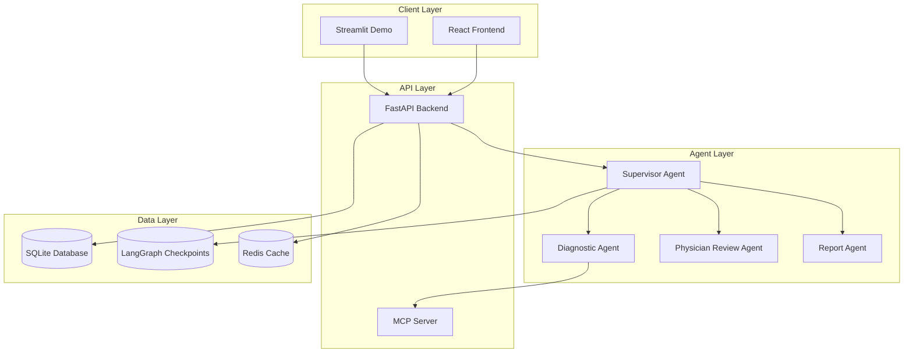
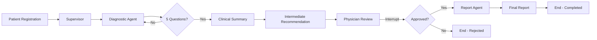
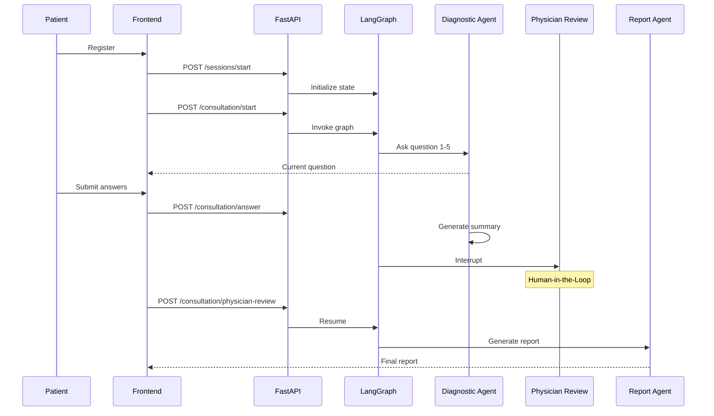
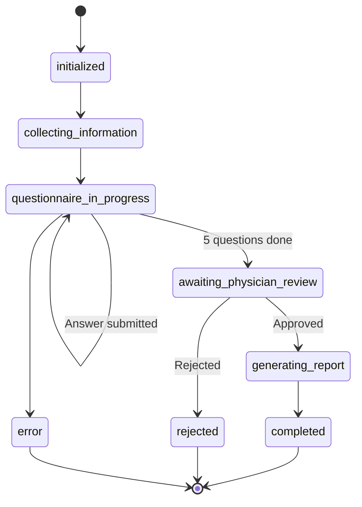
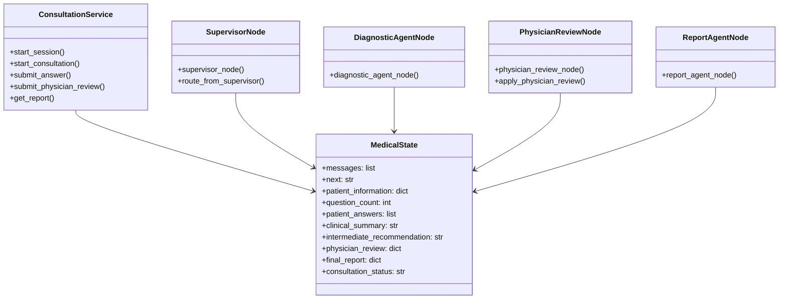

# MediGraph AI - System Diagrams

## Architecture Diagram

```mermaid
graph TB
    subgraph Client Layer
        FE[React Frontend]
        ST[Streamlit Demo]
    end

    subgraph API Layer
        API[FastAPI Backend]
        MCP[MCP Server]
    end

    subgraph Agent Layer
        SUP[Supervisor Agent]
        DIAG[Diagnostic Agent]
        PHYS[Physician Review Agent]
        REP[Report Agent]
    end

    subgraph Data Layer
        DB[(SQLite Database)]
        CKPT[(LangGraph Checkpoints)]
        REDIS[(Redis Cache)]
    end

    FE --> API
    ST --> API
    API --> SUP
    SUP --> DIAG
    SUP --> PHYS
    SUP --> REP
    DIAG --> MCP
    API --> DB
    SUP --> CKPT
    API --> REDIS
```

## Workflow Diagram

```mermaid
flowchart LR
    A[Patient Registration] --> B[Supervisor]
    B --> C[Diagnostic Agent]
    C --> D{5 Questions?}
    D -->|No| C
    D -->|Yes| E[Clinical Summary]
    E --> F[Intermediate Recommendation]
    F --> G[Physician Review]
    G -->|Interrupt| H{Approved?}
    H -->|Yes| I[Report Agent]
    H -->|No| J[End - Rejected]
    I --> K[Final Report]
    K --> L[End - Completed]
```

## Sequence Diagram

```mermaid
sequenceDiagram
    participant P as Patient
    participant FE as Frontend
    participant API as FastAPI
    participant LG as LangGraph
    participant PA as Diagnostic Agent
    participant PR as Physician Review
    participant RA as Report Agent

    P->>FE: Register
    FE->>API: POST /sessions/start
    API->>LG: Initialize state
    FE->>API: POST /consultation/start
    API->>LG: Invoke graph
    LG->>PA: Ask question 1-5
    PA-->>FE: Current question
    P->>FE: Submit answers
    FE->>API: POST /consultation/answer
    PA->>PA: Generate summary
    LG->>PR: Interrupt
    Note over PR: Human-in-the-Loop
    FE->>API: POST /consultation/physician-review
    API->>LG: Resume
    LG->>RA: Generate report
    RA-->>FE: Final report
```

## State Diagram

```mermaid
stateDiagram-v2
    [*] --> initialized
    initialized --> collecting_information
    collecting_information --> questionnaire_in_progress
    questionnaire_in_progress --> questionnaire_in_progress: Answer submitted
    questionnaire_in_progress --> awaiting_physician_review: 5 questions done
    awaiting_physician_review --> generating_report: Approved
    awaiting_physician_review --> rejected: Rejected
    generating_report --> completed
    completed --> [*]
    rejected --> [*]
    questionnaire_in_progress --> error
    error --> [*]
```

## Class Diagram

```mermaid
classDiagram
    class MedicalState {
        +messages: list
        +next: str
        +patient_information: dict
        +question_count: int
        +patient_answers: list
        +clinical_summary: str
        +intermediate_recommendation: str
        +physician_review: dict
        +final_report: dict
        +consultation_status: str
    }

    class ConsultationService {
        +start_session()
        +start_consultation()
        +submit_answer()
        +submit_physician_review()
        +get_report()
    }

    class SupervisorNode {
        +supervisor_node()
        +route_from_supervisor()
    }

    class DiagnosticAgentNode {
        +diagnostic_agent_node()
    }

    class PhysicianReviewNode {
        +physician_review_node()
        +apply_physician_review()
    }

    class ReportAgentNode {
        +report_agent_node()
    }

    ConsultationService --> MedicalState
    SupervisorNode --> MedicalState
    DiagnosticAgentNode --> MedicalState
    PhysicianReviewNode --> MedicalState
    ReportAgentNode --> MedicalState
```
